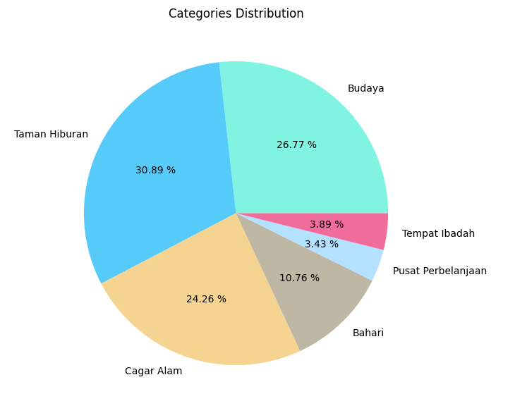
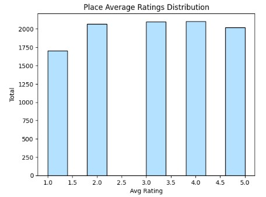
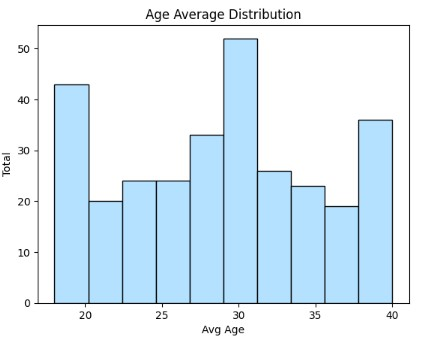
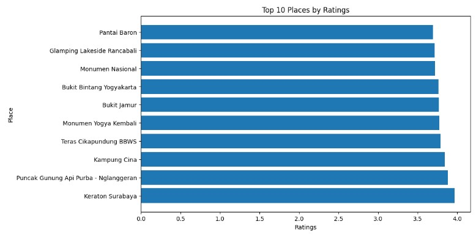
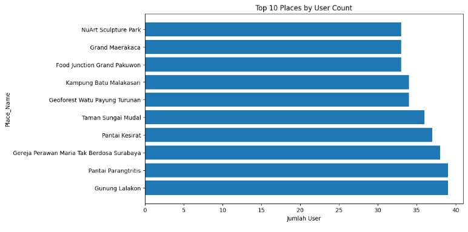
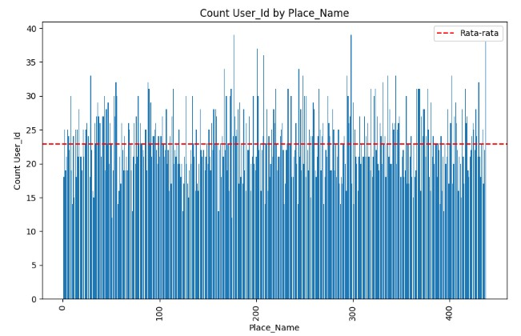
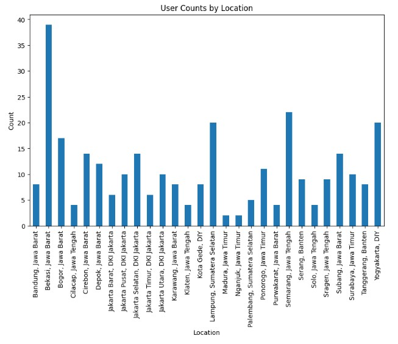
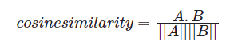
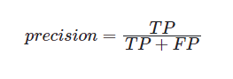
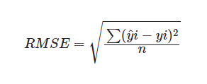

# Laporan Proyek Machine Learning Submission 2 - Aswin Asrianto

## Project Overview

### Latar belakang

Dalam industri pariwisata, Indonesia adalah salah satu tujuan wisata terkemuka di dunia dengan banyaknya objek wisata yang menarik, mulai dari pantai yang indah, gunung yang megah, budaya yang kaya, hingga keanekaragaman alam yang menakjubkan. Hal ini dikarenakan indonesia mempunyai alam yang sangat indah.  Wisata alam yang ada di Indonesia pun tidak hanya berada di satu wilayah tetapi tersebar di seluruh wilayah Indonesia [1].

Namun, dalam melihat banyaknya pilihan objek wisata di Indonesia, seringkali wisatawan menghadapi kesulitan dalam memilih objek wisata yang cocok untuk mereka kunjungi. Setiap wisatawan memiliki preferensi yang berbeda-beda, seperti minat dalam petualangan alam, budaya, sejarah, atau kuliner sehingga preferesi merupakan aspek yang penting berdasarkan hasil penelitian preferensi wisatawan memiliki pengaruh positif dan signifikan terhadap keputusan berkunjung ke objek wisata [2]. Oleh karena itu, penting untuk memiliki sistem rekomendasi yang dapat membantu wisatawan dalam mengidentifikasi dan menemukan objek wisata yang sesuai dengan preferensi mereka.

Sistem rekomendasi objek wisata dapat memanfaatkan teknologi kecerdasan buatan dan analisis data untuk memberikan rekomendasi yang personal dan relevan kepada wisatawan. Dengan menggunakan informasi seperti preferensi wisatawan, lokasi geografis, waktu kunjungan, dan ulasan dari pengguna lain, sistem rekomendasi dapat memilih dan merekomendasikan objek wisata yang paling sesuai untuk wisatawan tersebut. 

Selain membantu wisatawan dalam memilih objek wisata, proyek ini juga dapat memberikan manfaat kepada industri pariwisata di Indonesia. Dengan mempromosikan objek wisata yang kurang dikenal namun menarik, sistem rekomendasi dapat membantu meningkatkan kunjungan wisata ke daerah-daerah yang belum terlalu terkenal. Hal ini dapat berdampak positif bagi ekonomi lokal dan mendorong pembangunan pariwisata yang lebih berkelanjutan.

Dengan adanya sistem rekomendasi objek wisata yang canggih dan efektif, diharapkan wisatawan dapat merencanakan perjalanan mereka dengan lebih baik, menemukan objek wisata yang sesuai dengan minat mereka, dan mengoptimalkan pengalaman wisata mereka di Indonesia.

### Manfaat Proyek

1. manfaat teoritis
   menambah wawasan penulis dalam pengembangan sistem rekomendasi tempat wisata di indonesia

2. manfaat praktis <br>
   - bagi pemerintah : membantu pemerintah mempromosikan objek wisata indonesia dimana indonesia memiliki banyak objek wisata yang indah namun belum terkenal khususnya di daerah-daerah terpencil. 
   
   - bagi masyarakat : membantu meningkatkan pendapatan masyarakat di daerah wisata serta membantu wisatawan dalam pengambilan keputusan dalam memilih objek wisata. 
  

## Business Understanding
Dari latar belakang yang di jabarkan sebelumnya maka, sistem ini akan sangat membantu wisatawan untuk menentukan tempat wisata berdasarkan preferensinya. Hal ini juga akan berdampak significan pada sektor pariwisata dan masyarakat sekitar.
   
### Problem Statements  
- Bagaimana cara memberikan rekomendasi tempat wisata yang relevan kepada pengguna berdasarkan preferensi dan perilaku mereka?
- Bagaimana memanfaatkan informasi dari data pengguna dan feature item tempat wisata untuk menghasilkan rekomendasi yang personal dan akurat?
  
### Goals
- Membuat sistem rekomendasi tempat wisata yang relevan kepada pengguna berdasarkan preferensi dan perilaku mereka.
- Mengoptimalkan pemanfaatan dari data pengguna dan feature item tempat wisata untuk menghasilkan rekomendasi yang personal dan akurat.
    
## Data Understanding

Dataset yang digunakan berdasal dari kaggle dengan nama [Indonesia Tourism Destination](https://www.kaggle.com/datasets/aprabowo/indonesia-tourism-destination). dataset tersebut yang memiliki 4 file yaitu 

- tourism_with_id.csv yang berisi informasi tempat wisata di 5 kota besar di indonesia yang berjumlah 437 baris
- user.csv which berisi data dummy user untuk membuat fitur rekomendasi berdasarkan user yang berjumlah 300 baris.
- tourism_rating.csv berisi 3 kolom yaitu user,tempat dan rating yang berfungsi untuk membuat sistem rekomendasi rating yang berjumlah 10000
- package_tourism.csv berisi rekomendasi tempat berdasarkan waktu, biaya, dan rating yang berjumlah 100 baris

- variabel pada data tourism_with_id : 'Place_Id', 'Place_Name', 'Description', 'Category', 'City','Price', 'Rating', 'Time_Minutes', 'Coordinate', 'Lat', 'Long'
- variabel pada data user : 'User_Id', 'Location', 'Age'
- variabl pada data rating : 'User_Id', 'Place_Id', 'Place_Ratings'
- variabel pada data package_tourism : 'Package', 'City', 'Place_Tourism1', 'Place_Tourism2','Place_Tourism3', 'Place_Tourism4', 'Place_Tourism5'

### Data variabel 

- Place_Id : id tempat wisata
- Place_Name : nama tempat wisata
- Description : deskripsi dari tempat wisata
- Category : kategori tempat wisata dimana terdapat 6 kategori yaitu budaya,taman hiburan, cagar alam, bahari, pusat perbelanjaan, tempat ibadah
- City : kota tempat wisata, pada dataset ini masih terbatas pada 5 kota besar yaitu jakarta, yogyakarta, bandung, semarang, surabaya.
- Price : harga masuk ke tempat wisata, dimana range mulai dari 0 (gratis) - 125.000
- Rating : penilaian terhadap tempat wisata 
- Time_Minutes : waktu tempuh ke tempat wisata dalam satuan menit
- Coordinate : koordinat long lat dari tempat wisata
- Lat : kordinat latitude dari lokasi
- Long : kordinat langitude dari lokasi
- User_Id : id user
- Location : kota dan provinsi dari tempat wisata
- Age : umur 
- Place_Ratings : penilaian tempat wisata
- Package : id package
- Place_Tourism1 : tempat wisata ke 1
- Place_Tourism2 : tempat wisata ke 2
- Place_Tourism3 : tempat wisata ke 3
- Place_Tourism4 : tempat wisata ke 4
- Place_Tourism5 : tempat wisata ke 5

  
### EDA

- Melakukan beberapa tahapan yang diperlukan untuk memahami data, contohnya teknik visualisasi data beserta insight atau exploratory data analysis.

<br>
Gambar 1 Distribusi Kategori

berdasarkan gambar diatas diketahui bahwa kategori taman hiburan memiliki persentase paling tinggi kemudian disusul oleh budaya dan cagar alam.

<br>
Gambar 2 Distribusi rata-rata ratings

berdasarkan grafik tersebut setiap rating memiliki distribusi hampir sama kecuali rating 1 dan 2.5

<br>
Gambar 3 Distribusi rata-rata umur data user

berdasarkan grafik tersebut rata-rata umur terbanyak berada pada umur rentang 20,30 dan 40.

<br>
Gambar 4 Top 10 tempat berdasarkan rating

berdasarkan grafik diatas diperoleh bahwa keraton surabaya menjadi tempat dengan rating tertingg disusul puncul gunung api purba kemudian teras cikapundung. 

<br>
Gambar 5 Top 10 tempat banyaknya jumlah penilaian oleh user 

berdasarkan gambar diatas diperoleh bahwa jumlah terbanyak user memberikan penilaian berada pada rentang 40 user pada tempat wisata gunung lalakon. dapat dilihat juga bahwa distribusi penilaian tiap tempat cenderung tidak seimbang sehingga perlu dinormalisasi nantinya.

<br>
Gambar 6 distribusi rating tiap tempat

berdasarkan data diatas bahwa jumlah penilaian user terbanyak adalah 39 dan terkecil adalah 12 sedangkan rata2 jumlah penilaian tiap tempat berada pada range 20-25

<br>
Gambar 7 total jumlah kota tempat tinggal user

berdasarkan gambar diperoleh bahwa user terbanyak berasal dari bekasi jawa barat.


## Data Preparation

persiapan data dibagi beberapa tahap:

### data preprocessing

persiapan pertama secara umum yang nantinya digunakan untuk model content based filtering.

#### cek data null
cek data null pada data dat_tourism_rating, dat_tourism_id, dat_tourism_user. Didapatkan bahwa dat_tourism_id memiliki data null pada kolom time_minutes dan unnamed. 

#### hapus kolom yang tidak diperlukan 
kolom 'Rating','Time_Minutes','Coordinate','Lat','Long','Unnamed: 11','Unnamed: 12' pada dat_tourism_id akan dihapus karena tidak diperlukan dalam pembuatan sistem rekomendasi. kolom rating juga dihapus karena kolom rating yg akan digunakan bukan pada dataset ini melainkan pada dataset dat_tourism_rating.

#### penggabungan 2 dataset dan group by 

```python
pd.merge(dat_tourism_rating.groupby('Place_Id')['Place_Ratings'].mean(),dat_tourism_id,on='Place_Id')
```
penjelasan :

- groupby('Place_Id') : mengelompokkan data berdasarkan nilai unik dalam kolom Place_Id 
- ['Place_Ratings'].mean() : menghitung nilai rata2 dari kolom place_ratings
- pd.merge(dat_tourism_rating .., dat_tourism_id , on='Place_id') : penggabungan (join) antara dataset dat_tourism_rating dan dat_tourism_id berdasarkan (on) kolom Place_id antara kedua dataset.

alasan:
pada dat_tourism_rating hanya akan diambil nilai rata2 dari rating tiap tempat wisata. kemudian digabungkan dengan dataset utama yaitu dat_tourism_id

``hasil proses diatas disimpan dalam variabel dat_rekomendasi. Data yang digunakan yaitu dataset dat_tourism_id dan dat_tourism_rating``

### Content based filtering

1. Data Preparation
   - data yang digunakan adalah data pada variabel dat_rekomendasi

2. Data Preprocessing
   - perubahan kata ke huruf kecil untuk konsistensi dan normalisasi
   - menghapus stopword, Dalam bahasa Indonesia, beberapa contoh stopwords yang umum digunakan antara lain: "saya", "sedang", "dan", "yang", "dari", "ke", "itu", "adalah", "atau", "untuk", "dengan", dan sebagainya. Stopwords ini sering dihilangkan dalam pemrosesan teks untuk mengurangi noise dan meningkatkan relevansi teks yang diproses.
   - mengubah kata menjadi kata dasarnya dengan fungsi stem dengan tujuan untuk mengurangi variasi kata yang memiliki akar kata yang sama. Dalam pemrosesan bahasa alami, kata-kata dengan akar yang sama dianggap setara dan dapat mewakili makna yang serupa. 
   - membuat kolom baru yaitu kolom tags dari penggabungan kolom Description dan kolom Category
   - menghapus kolom yang tidak dibutuhkan yaitu kolom price,place_ratings, description, category, city
 
### Collaborative filtering

1. Data Preparation
   - data yang digunakan yaitu dat_tourism_rating   

   - Kemudian, fitur-fitur yang akan digunakan untuk sistem rekomendasi akan di-encode ke dalam bentuk numerik. Adapun fitur-fitur yang digunakan untuk sistem rekomendasi pada proyek ini adalah userID yang disimpan dalam kolom baru bernama customer, Place_Id yang disimpan dalam kolom baru bernama tourism, dan Place_Ratings.
   
   - Terakhir data dipecah menjadi data training dan data testing dengan rasio 80%:20%. Fitur prediktor yang digunakan adalah user dan tourism. Fitur targetnya adalah Place_Ratings.

## Modeling
Tahapan ini membahas mengenai model sisten rekomendasi yang Anda buat untuk menyelesaikan permasalahan. Sajikan top-N recommendation sebagai output.


### Content based filtering

Dalam pendekatan ini, digunakan metode TF-IDF dan Cosine Similarity untuk memperoleh rekomendasi yang relevan.

Pertama, membangun matriks TF-IDF dari kategori tempat. Matriks ini akan merepresentasikan setiap tempat dalam dataset sebagai vektor numerik berdasarkan frekuensi kata dalam kategori tempat tersebut. TF-IDF mengukur seberapa penting suatu kata dalam sebuah dokumen atau konteks. Nilai TF-IDF tinggi menunjukkan kata yang spesifik dan relevan untuk dokumen tersebut. Langkah pertama dalam pembangunan matriks TF-IDF adalah menghitung Term Frequency (TF), yaitu frekuensi kata dalam deskripsi tempat. Selanjutnya, perlu dihitung Inverse Document Frequency (IDF), yaitu kebalikan dari frekuensi kata di seluruh dokumen. Ini mengurangi bobot kata-kata yang umum dan meningkatkan bobot kata-kata yang jarang muncul. Akhirnya, matriks TF-IDF terbentuk dengan mengalikan nilai TF dengan nilai IDF. Matriks ini akan menjadi representasi numerik dari kategori tempat dalam dataset.

Setelah matriks TF-IDF terbentuk, langkah berikutnya adalah menghitung cosine similarity antara setiap pasangan tempat. Cosine similarity mengukur kesamaan antara dua vektor dengan mengukur sudut antara vektor-vektor tersebut. Semakin kecil sudut antara vektor-vektor, semakin mirip tempat-tempat tersebut. Untuk menghitung cosine similarity, dapat digunakan formula cosine similarity:

<br>
gambar 3. rumus coisine similarity

Dengan menghitung cosine similarity antara semua pasangan tempat, dapat diperoleh matriks similarity antara tempat-tempat dalam dataset. Nilai cosine similarity ini dapat digunakan untuk menemukan tempat-tempat yang paling mirip satu sama lain. Semakin tinggi nilai cosine similarity antara dua tempat, semakin mirip kedua tempat tersebut.

Dengan menggunakan metode TF-IDF dan Cosine Similarity dalam content-based filtering, dapat diperoleh rekomendasi tempat yang memiliki kategori yang mirip dengan tempat yang sedang ditinjau oleh pengguna. Hal ini memungkinkan sistem rekomendasi untuk mengidentifikasi dan merekomendasikan tempat yang memiliki kesamaan konten dengan tempat yang disukai oleh pengguna.

Kelebihan dari pendekatan ini adalah kemampuannya dalam memberikan rekomendasi yang relevan berdasarkan konten tempat, bahkan bisa menjangkau tempat yang baru muncul. Namun kekurangannya adalah kurangnya kemampuan untuk menemukan preferensi pelanggan lain, dan baru bisa memberikan rekomendasi tempat jika memang pengguna sedang melakukan pencarian dengan keyword.

Output dari pendekatan Content-Based Filtering ini adalah daftar tempat rekomendasi berdasarkan keyword yang dimasukan. Misalnya, pengguna aplikasi melakukan pencarian dengan keyword "Monumen Nasional", maka akan ditampilkan beberapa rekomendasi tempat yang relevan dengan keyword "Monumen Nasional".

Diperoleh top 9 rekomendasi tempat berdasarkan keyword tersebut:

|Nama Tempat| Coisine_similarity|
|----------|-------|
|Monumen Bandung Lautan Api|0.28|
|Monumen Selamat Datang|0.26|
|Monumen Perjuangan Rakyat Jawa Barat|0.25|
|Tugu Muda Semarang|0.22|
|Monumen Bambu Runcing Surabaya|0.20|

Tabel 1. Tabel Top 5 rekomendasi content-based filtering

### Colaborative filtering

Digunakan model RecommerderNet berbasis TensorFlow untuk mempelajari pola preferensi pelanggan dan interaksi mereka dengan tempat. Model ini menggunakan embedding untuk merepresentasikan user dan tourism. Penggabungan embedding tersebut untuk dapat memprediksi preferensi user terhadap tempat wisata tertentu.

Berbeda dengan pendekatan Content-Based Filtering yang hanya menggunakan data informasi tentang tempat saja, pendekatan ini akan menggunakan data user juga.

Dataset yang digunakan dibagi menjadi data traning dan data testing dengan rasio 80%:20%.

Kelebihan dari pendekatan ini adalah kemampuannya dalam menemukan pola preferensi pelanggan yang kompleks dan merekomendasikan tempat berdasarkan preferensi serupa dari pelanggan lain. Namun kekurangan dari pendekatan ini adalah adanya masalah cold-start, yaitu saat pelanggan baru atau tempat baru tidak memiliki cukup interaksi untuk memberikan rekomendasi yang akurat.

Output dari pendekatan ini adalah daftar tempat rekomendasi untuk setiap user. Misalnya, pelanggan B akan menerima rekomendasi berupa daftar tempat yang banyak disukai oleh pelanggan lain dengan preferensi yang serupa.

contoh hasil rekomendasi ke userID 147 dapat dilihat pada tabel 2.

|Nama Tempat|
|----------|
|Pantai Pulang Sawal|
|Jendela Alam|
|Monumen Bandung Lautan Api|
|Sunrise Point Cukul|
|Pantai Maron|

## Evaluation
Setelah model berhasil dibuat, akan dilakukan evaluasi dengan menggunakan metrik evaluasi untuk memvalidasi performa model.

### content-based Filtering

Pada pendekatan Content-Based Filtering, akan digunakan metrik evaluasi precision.

Precision adalah metrik evaluasi yang digunakan untuk mengukur sejauh mana sistem rekomendasi mampu memberikan rekomendasi yang relevan dan tepat kepada pengguna. Precision menggambarkan persentase item rekomendasi yang relevan dari keseluruhan item yang direkomendasikan. Presisi dapat dihitung menggunakan rumus berikut:



dimana:

- TP (True Positive) : jumlah item rekomendasi yang relevan yang benar-benar dipilih oleh pengguna
- FP (False Positive) : jumlah item rekomendasi yang tidak relevan yang dipilih oleh pengguna.

Digunakan 3 pencarian tempat secara acak, yaitu:

"Monumen Nasional". Dari 5 rekomendasi yang diberikan semuanya relevan. Sehingga nilai presisinya 100%.
"Taman Bungkul". Dari 5 rekomendasi yang diberikan semuanya relevan. Sehingga nilai presisinya 100%.
"Atlantis Water Adventure". Dari 5 rekomendasi yang diberikan semuanya relevan. Sehingga nilai presisinya 100%.

Dari hasil pencarian tempat di atas didapatkan rekomendasi relevan sebagai berikut 5 rekomendasi relevan pada pencarian 1, 5 rekomendasi relevan pada pencarian kedua dan 5 rekomendasi relevan pada pencarian ketiga sehingga total pencarian relevan hasil uji coba adalah 5+5+5=15 dan total pencarian tidak relevan adalah 0 sehingga  nilai akurasi nya adalah TP(15)/TP(15)+FP(0) = 15/15 atau 100% yang berarti semua hasil pencarian memperoleh rekomendasi yang relevan.

### Colaborative filtering

Pada pendekatan Collaborative Filtering, digunakan metrik evaluasi Root Mean Squared Error (RMSE). RMSE mengukur seberapa baik model Collaborative Filtering dalam memprediksi preferensi atau rating yang akan diberikan oleh pengguna pada item yang belum mereka sukai. RMSE mengukur perbedaan antara rating yang diprediksi oleh model dan rating yang sebenarnya oleh pengguna. Rumus untuk menghitung RMSE adalah sebagai berikut:



dimana :
- y` = rating prediksi
- y  = rating sebenarnya 
- n  = jumlah data

dengan proses training sebanyak 100 epoch diperoleh nilai evaluasi sbb:
- root_mean_squared_error : 0.3107
- val_root_mean_squared_error : 0.3600

Setelah menganalisis nilai RMSE pada data latih sebesar 0.3107 dan pada data validasi sebesar 0.36, ditemukan beberapa kesalahan yang perlu diperhatikan. Meskipun secara umum nilai RMSE tersebut tergolong rendah, masih terdapat kesalahan prediksi yang perlu ditinjau lebih lanjut. Dalam analisis kesalahan individu, ditemukan adanya beberapa outliers yang mempengaruhi prediksi secara signifikan, serta terdapat pola interaksi variabel yang kompleks yang tidak berhasil ditangkap oleh model regresi. Selain itu, terdapat beberapa contoh dengan nilai prediksi yang jauh dari nilai sebenarnya, yang mengindikasikan adanya faktor lain yang mungkin tidak dipertimbangkan dalam model. Oleh karena itu, perlu dilakukan evaluasi ulang terhadap fitur-fitur yang digunakan serta mempertimbangkan penggunaan model regresi yang lebih kompleks atau teknik regresi lanjutan. Penggunaan teknik cross-validation juga direkomendasikan untuk memperoleh perkiraan RMSE yang lebih stabil dan menghindari overfitting pada data latih

## Analisa hasil

Dari nilai metrik evaluasi terlihat model memiliki kemampuan rekomendasi yang baik. Terlebih pada pendekatan content-based filtering yang presisinya bisa mencapai 100% yang artinya tempat yang direkomendasikan sangat relevan dengan tempat yang sedang dicari. Ini juga menjadi kelebihan pendekatan content-based filtering yang bisa secara tepat memberikan rekomendasi barang yang spesifik. Namun kelemahannya adalah tempat yang ditampilkan tidak luas, dengan kata lain, pada studi case ini tidak akan ditemukan tempat lainnya yang tidak sesuai dengan keyword yang  cari.

Namun untuk pendekatan collaborative filtering, memang terlihat bahwa tempat yang direkomendasikan cukup tercampur. Karena tujuan dari pendekatan ini tidak hanya mencari tempat dengan kategori yang sama, tetapi juga kategori lainnya yang kemungkinan disukai oleh pengguna. Ini menjadi kelebihan pendekatan collaborative filtering yang bisa menemukan tempat lain yang mungkin sebelumnya  belum ketahui user tersebut, tetapi mungkin pengguna akan menyukainya. Kelemahannya adalah rekomendasi yang diberikan bisa jadi sedikit random karena tempat yang direkomendasikan adalah berdasarkan tren yang sedang disukai pengguna lain.

## Kesimpulan
Sistem rekomendasi memberikan performa yang baik dengan pendekatan Content-Based Filtering maupun Collaborative Filtering.

Pada Content-Based Filtering, sistem berhasil memberikan nilai evaluasi precision hingga 100% pada contoh 3 pencarian tempat yang diuji.

Pada Collaborative Filtering, diperoleh evaluasi RMSE pada data validasi sebesar 0.3600 dan ketika diuji kepada pengguna, tempat yang direkomendasikan beragam berdasarkan tren dari pengguna lain.

## Daftar pustaka

[1] RYAN, R. K. (2016). PENGARUH NILAI WISATAWAN TERHADAP NIAT BERKUNJUNG KEMBALI DI OBJEK WISATA HARAU KABUPATEN LIMA PULUH KOTA (Doctoral dissertation, Univeristas Andalas).

[2] Iftariani, D. (2021). Pengaruh Preferensi Wisatawan Terhadap Keputusan Berkunjung Ke Objek Wisata Istano Basa Pagaruyung Batusangkar (Doctoral dissertation, Universitas Islam Riau).
